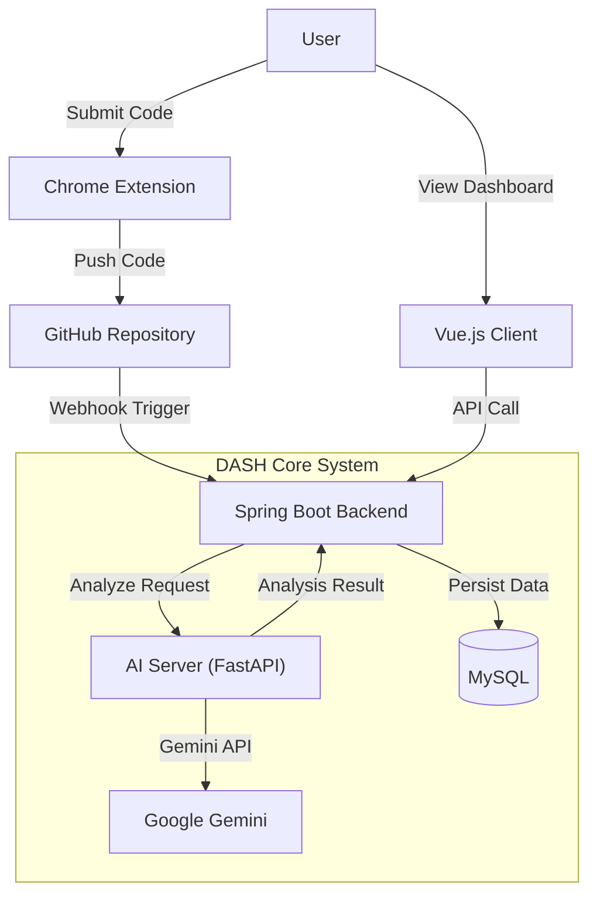

# DASH : 기록을 넘어 성장을 설계하다

<div align="center">
  
  <br/>
  <h3>All-in-One Algorithm Study Platform</h3>
  <br/>

  [](https://www.java.com/)
  [](https://spring.io/projects/spring-boot)
  [](https://vuejs.org/)
  [](https://fastapi.tiangolo.com/)
  [](https://deepmind.google/technologies/gemini/)
  [](https://chromewebstore.google.com/detail/kimjgflahdmnlhilmojcoaechlgkokhc)
</div>

---

## 📖 Introduction

**DASH**는 알고리즘 스터디 운영의 고질적인 문제점(커리큘럼 부재, 형식적인 코드 리뷰, 수동 기록의 번거로움)을 기술적으로 해결하기 위해 개발된 **알고리즘 통합 플랫폼**입니다.

Chrome Extension과 GitHub Webhook을 활용한 **Zero-Manual 파이프라인**을 구축하여, 사용자가 문제 풀이에만 집중하면 **기록, 분석, AI 피드백**까지 모든 과정이 자동으로 이루어집니다. Solved.ac 데이터를 기반으로 개인의 역량을 정밀 진단하고, RPG 게임 요소를 결합한 스킬 트리 시스템을 통해 성장의 즐거움을 제공합니다.

### 💡 Core Value
* **Zero-Manual Automation**: 문제 풀이 제출 시 자동 커밋 ＆ 코드 분석 ＆ 대시보드 갱신까지 원스톱으로 처리합니다.
* **Data-Driven Growth**: Solved.ac ID 입력 하나만으로 객관적 실력 지표(Radar Chart) 및 취약점을 분석합니다.
* **AI Coaching**: Google Gemini 기반의 코드 복잡도 분석, 인라인 코드 리뷰, 맞춤형 튜터를 지원합니다.
* **Gamification**: RPG 스타일의 스킬 트리, 실전 모의고사, 랜덤 디펜스로 재미와 성장을 엮었습니다.

---

## 🛠 Tech Stack

### Backend (`/backend`)
안정적인 데이터 처리와 확장성을 고려하여 **Hexagonal Architecture(Port-Adapter 패턴)** 지향 설계를 적용했습니다.
* **Framework**: Spring Boot 3.5.8
* **Language**: Java 17
* **Persistence**: MyBatis 3.0.5, MySQL, H2 (Test)
* **Security**: Spring Security, OAuth2 Client (GitHub), JWT
* **API Documentation**: SpringDoc OpenAPI (Swagger) 2.8.5
* **Architecture**: Domain-Driven Design (DDD) principles, Layered Architecture with DIP

### Frontend (`/frontend`)
사용자 경험(UX) 최적화와 시각적 데이터 표현에 중점을 두었습니다.
* **Framework**: Vue 3 (Composition API)
* **Build Tool**: Vite
* **State Management**: Pinia
* **Styling**: TailwindCSS, PostCSS
* **Visualization**: Chart.js (통계), Vue Flow (스킬 트리/로드맵), D3.js
* **Editor**: Monaco Editor (VS Code 경험 제공)

### AI Server (`/ai`)
LLM을 활용한 고품질 코드 분석 및 튜터링 서비스를 제공합니다.
* **Framework**: FastAPI
* **Model**: Google Gemini Pro (via `google-genai` SDK)
* **Architecture**: Modular Service Layer, Pydantic Schema Validation

---

## 🏗 System Architecture

DASH는 **Web Client**, **Backend API**, **AI Serving**, 그리고 **Chrome Extension**이 유기적으로 연결된 구조를 가집니다.



### Key Engineering Decisions
1. **DIP(의존성 역전 원칙) 적용**: `Domain` 레이어를 외부 기술(Infra)로부터 격리하여 비즈니스 로직의 순수성을 유지했습니다.
2. **비동기 이벤트 처리**: EventWorker로 코드 분석 및 데이터 갱신 작업을 비동기 처리하여 사용자 경험을 저해하지 않습니다.
4. **크롬 익스텐션 활용**: DOM 파싱의 불안정성을 제거하고, 실패한 코드(오답)까지 수집하여 학습 데이터로 활용합니다.

---

## 📂 Project Structure

모노레포(Monorepo) 구조로 구성되어 있습니다.

```bash
utact/dash/
├── backend/                # Spring Boot Application
│   ├── src/main/java/com/ssafy/dash/
│   │   ├── acorn/          # 재화(도토리) 도메인
│   │   ├── ai/             # AI 서비스 연동
│   │   ├── algorithm/      # 알고리즘 기록 관리
│   │   ├── analytics/      # 통계 및 분석
│   │   ├── board/          # 커뮤니티 게시판
│   │   ├── defense/        # 디펜스 게임 로직
│   │   ├── github/         # GitHub Webhook 처리
│   │   ├── mockexam/       # 모의고사 시스템
│   │   ├── problem/        # 문제 및 태그 관리
│   │   └── study/          # 스터디 그룹 관리
│   └── ...
├── frontend/               # Vue.js Application
│   ├── src/
│   │   ├── api/            # Axios API 모듈
│   │   ├── components/     # 재사용 가능한 UI 컴포넌트
│   │   ├── views/          # 페이지 단위 뷰
│   │   └── ...
└── ai/                     # FastAPI AI Service
    ├── app/
    │   ├── api/            # Endpoints (Routes)
    │   ├── core/           # LLM Prompts & Configs
    │   └── services/       # Business Logic
    └── ...
```

---

## 🚀 Getting Started

각 모듈별 설정이 필요합니다.

### Prerequisites
* Java JDK 17+
* Node.js 18+
* Python 3.10+
* MySQL 8.0+

### 1. Backend Setup
```bash
cd backend
# application.properties 설정 필요 (DB, OAuth, AI Server URL 등)
./mvnw clean install
./mvnw spring-boot:run
```

### 2. AI Server Setup
```bash
cd ai
python -m venv venv
source venv/bin/activate  # Windows: venv\Scripts\activate
pip install -r requirements.txt
# .env 파일 설정 필요 (GOOGLE_API_KEY 등)
python app/main.py
```

### 3. Frontend Setup
```bash
cd frontend
npm install
npm run dev
```

---

## ✨ Key Features Showcase

### 📊 AI Competency Analysis
Solved.ac ID를 입력하면 3초 내에 사용자의 알고리즘 풀이 패턴을 분석하여 **Radar Chart**와 **강점/약점 태그**를 시각화합니다.

### 🤖 Intelligent Code Review
코드를 제출하는 즉시 AI가 다음 항목을 분석합니다:
* **Time/Space Complexity**: Big-O 표기법 기반의 시간/공간 복잡도를 자동 계산하고, 그 이유를 명확히 설명
* **AI Analysis**: 특정 코드에 마우스를 올리면(Hover), 해당 코드의 구현 의도와 핵심 기능을 AI가 파악하여 설명
* **Algorithm Pattern**: 사용된 주요 알고리즘 기법(DP, DFS 등)을 자동으로 분류하여 태깅

### 🌲 RPG Skill Tree
마치 게임을 하듯 알고리즘 스킬을 해금해 나갑니다. 선행 개념을 익혀야 상위 알고리즘 문제에 도전할 수 있는 체계적인 커리큘럼을 제공합니다.

---

## 👨‍💻 Contributors

| Role | Name | Responsibility |
|:---:|:---:|:---|
| PM / BE / FE | [유승준](https://github.com/utact) | 기획, 시스템 설계, Backend Core, DB 모델링, Chrome Extension |
| AI / BE / FE | [김용수](https://github.com/canit0221) | AI Modeling & Serving, Backend API, Frontend Core, 데이터 시각화 |
| BE / FE | [유소민](https://github.com/SoMin-Yoo) | Chrome Extension, UI/UX 최적화, QA 및 테스트, 코드 품질 관리 |

---

## 📜 License

This project is licensed under the [MIT License](LICENSE).
