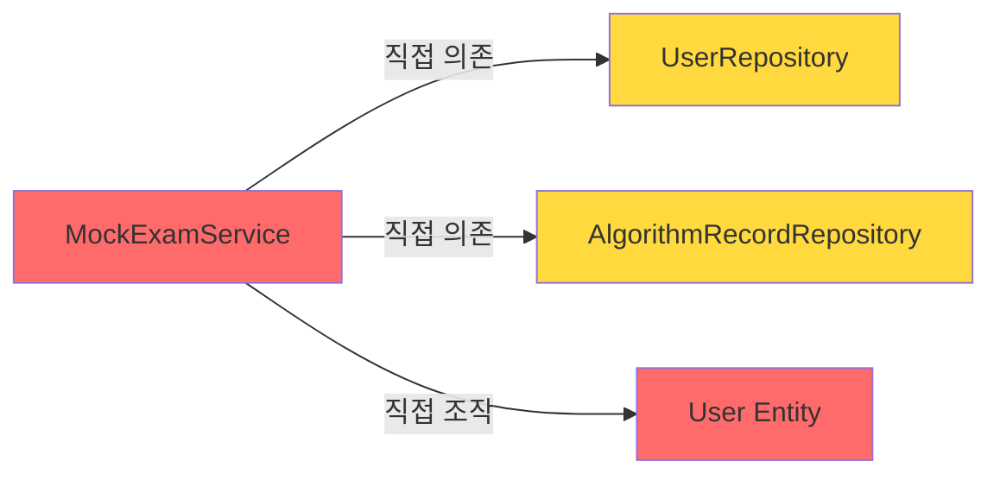

# Mockexam Domain 클린 아키텍처 점검 보고서

**점검 일시**: 2026-01-01  
**표준 도메인**: `user`  
**점검 대상**: `mockexam`

---

## 📋 분석 개요

User 도메인은 다음과 같은 클린 아키텍처 구조를 따르고 있습니다:

```
user/
├── application/
│   ├── UserService.java
│   └── dto/
│       ├── command/
│       │   ├── UserCreateCommand.java
│       │   └── UserUpdateCommand.java
│       └── result/
│           └── UserResult.java
├── domain/
│   ├── User.java (Entity)
│   ├── UserRepository.java (Interface)
│   └── exception/
│       └── UserNotFoundException.java
├── infrastructure/
│   ├── mapper/
│   │   └── UserMapper.java (MyBatis Mapper)
│   └── persistence/
│       └── UserRepositoryImpl.java (Repository 구현체)
└── presentation/
    ├── UserController.java
    └── dto/
        ├── request/
        │   ├── UserCreateRequest.java
        │   └── UserUpdateRequest.java
        └── response/
            └── UserResponse.java
```

### 핵심 원칙

1. **Domain Layer**: 비즈니스 엔티티와 Repository 인터페이스만 포함
2. **Infrastructure Layer**: Repository 구현체와 외부 기술(MyBatis Mapper) 포함
3. **Application Layer**: 비즈니스 로직과 Command/Result DTO
4. **Presentation Layer**: Controller와 Request/Response DTO

---

## ❌ Mockexam Domain 현재 구조

```
mockexam/
├── application/
│   ├── MockExamService.java
│   └── dto/
│       └── result/
│           └── ExamStatusResult.java
├── domain/
│   ├── MockExamProblemBank.java (상수 클래스)
│   └── MockExamType.java (Enum)
└── presentation/
    └── MockExamController.java
        └── (내부 record: ExamStatusResponse, StartExamRequest, ExamTypeInfo)
```

---

## 🚨 아키텍처 위반 사항

### 1. **Infrastructure Layer 누락** ⚠️ **CRITICAL**

> [!CAUTION]
> Mockexam 도메인에 `infrastructure` 패키지가 **완전히 누락**되어 있습니다.

**문제점**:
- MockExam 도메인에는 자체 Repository가 없음
- `MockExamService`가 다른 도메인의 Repository(`UserRepository`, `AlgorithmRecordRepository`)를 **직접 의존**
- User 엔티티를 직접 조작하여 모의고사 상태를 저장 (User 엔티티 오염)

**위반 코드** ([MockExamService.java:L30-31](file:///c:/dash/backend/src/main/java/com/ssafy/dash/mockexam/application/MockExamService.java#L30-L31)):
```java
private final UserRepository userRepository;
private final AlgorithmRecordRepository algorithmRecordRepository;
```

**표준 구조와 비교**:
- ✅ User 도메인: `UserRepository` 인터페이스(domain) + `UserRepositoryImpl` 구현체(infrastructure)
- ❌ Mockexam 도메인: Repository 없음, 다른 도메인 Repository에 직접 의존

---

### 2. **Domain Layer 부실** ⚠️ **HIGH**

> [!WARNING]
> Domain Layer에 비즈니스 엔티티가 없고, 상수 클래스와 Enum만 존재합니다.

**현재 구조**:
- `MockExamProblemBank.java`: 문제 번호 상수만 보관하는 유틸리티 클래스
- `MockExamType.java`: Enum

**문제점**:
- 모의고사 세션을 나타내는 도메인 엔티티가 없음
- 모의고사 관련 비즈니스 로직이 `User` 엔티티에 침투
  - `User.examType`, `User.examProblems`, `User.examStartTime`, `User.examSolvedCount` 등

**User 엔티티 오염 예시** ([MockExamService.java:L67-70](file:///c:/dash/backend/src/main/java/com/ssafy/dash/mockexam/application/MockExamService.java#L67-L70)):
```java
// MockExamService.java에서 User 엔티티를 직접 조작
user.setExamType(examType.name());
user.setExamProblems(toJson(selectedProblems));
user.setExamStartTime(LocalDateTime.now());
user.setExamSolvedCount(0);
```

**표준 구조와 비교**:
- ✅ User 도메인: `User.java` 엔티티가 사용자 관련 비즈니스 로직만 포함
- ❌ Mockexam 도메인: 도메인 엔티티 없음, User 엔티티에 모의고사 상태 저장

---

### 3. **Presentation Layer DTO 위치 위반** ⚠️ **MEDIUM**

> [!IMPORTANT]
> Presentation DTOs가 Controller 내부 record로 정의되어 있어 재사용성과 테스트 가능성이 떨어집니다.

**현재 구조** ([MockExamController.java:L69-91](file:///c:/dash/backend/src/main/java/com/ssafy/dash/mockexam/presentation/MockExamController.java#L69-L91)):
```java
public class MockExamController {
    // ...
    
    public record ExamStatusResponse(...) { }
    public record StartExamRequest(...) { }
    public record ExamTypeInfo(...) { }
}
```

**표준 구조와 비교**:
- ✅ User 도메인:
  - `presentation/dto/request/UserCreateRequest.java`
  - `presentation/dto/response/UserResponse.java`
- ❌ Mockexam 도메인: Controller 내부 record (별도 파일 없음)

**문제점**:
- DTO를 다른 곳에서 재사용 불가
- 단위 테스트 작성 시 Controller를 import해야 함
- 코드 가독성 저하

---

### 4. **도메인 간 강결합** ⚠️ **HIGH**

> [!WARNING]
> Mockexam 도메인이 User와 Algorithm 도메인에 강하게 결합되어 있습니다.

**의존성 분석**:



**위반 코드**:
```java
// MockExamService.java
import com.ssafy.dash.user.domain.User;
import com.ssafy.dash.user.domain.UserRepository;
import com.ssafy.dash.algorithm.domain.AlgorithmRecordRepository;
```

**클린 아키텍처 원칙 위반**:
- 도메인은 다른 도메인의 **인프라 계층(Repository 구현체)**에 의존해야 하며, 직접 다른 도메인의 Repository 인터페이스를 사용하면 안 됨
- 도메인 간 통신은 **Application Service를 통한 간접 호출** 또는 **Domain Event**를 사용해야 함

---

## 📊 비교 요약표

| 항목 | User Domain (표준) | Mockexam Domain (현재) | 준수 여부 |
|------|-------------------|----------------------|----------|
| **Domain Layer** | ✅ Entity + Repository Interface + Exception | ❌ Enum + 상수 클래스만 존재 | ❌ |
| **Infrastructure Layer** | ✅ RepositoryImpl + Mapper | ❌ 완전 누락 | ❌ |
| **Application Layer** | ✅ Service + Command/Result DTO | ⚠️ Service + Result DTO (Command 없음) | ⚠️ |
| **Presentation Layer** | ✅ Controller + Request/Response DTO (별도 파일) | ❌ Controller + 내부 record | ❌ |
| **도메인 격리** | ✅ 자체 Repository만 사용 | ❌ 다른 도메인 Repository 직접 의존 | ❌ |

---

## 🔧 권장 개선 사항

### 1. MockExam 도메인 엔티티 생성

```java
// domain/MockExam.java
public class MockExam {
    private Long id;
    private Long userId;
    private MockExamType examType;
    private String problems; // JSON
    private LocalDateTime startTime;
    private Integer solvedCount;
    private ExamStatus status; // ENUM: IN_PROGRESS, COMPLETED, TIMEOUT, CANCELLED
    
    // 비즈니스 로직
    public boolean isTimeout() { ... }
    public void markProblemSolved() { ... }
}
```

### 2. Repository 인터페이스 및 구현체 생성

```java
// domain/MockExamRepository.java
public interface MockExamRepository {
    void save(MockExam mockExam);
    Optional<MockExam> findByUserId(Long userId);
    void update(MockExam mockExam);
    void delete(Long id);
}

// infrastructure/persistence/MockExamRepositoryImpl.java
@Repository
public class MockExamRepositoryImpl implements MockExamRepository {
    private final MockExamMapper mockExamMapper;
    // ...
}
```

### 3. Presentation DTO 분리

```
presentation/
├── MockExamController.java
└── dto/
    ├── request/
    │   └── StartExamRequest.java
    └── response/
        ├── ExamStatusResponse.java
        └── ExamTypeInfoResponse.java
```

### 4. User 엔티티에서 모의고사 필드 제거

User 엔티티는 사용자 정보만 관리하고, 모의고사 상태는 `MockExam` 엔티티로 분리

---

## 📌 결론

> [!CAUTION]
> **Mockexam 도메인은 클린 아키텍처 표준을 따르지 않고 있습니다.**

**주요 문제점**:
1. ❌ Infrastructure Layer 완전 누락
2. ❌ Domain Entity 부재 (User 엔티티 오염)
3. ❌ 도메인 간 강결합 (다른 도메인 Repository 직접 의존)
4. ❌ Presentation DTO가 Controller 내부에 정의됨

**개선 우선순위**:
1. **HIGH**: MockExam 도메인 엔티티 생성 및 User 엔티티 분리
2. **HIGH**: MockExamRepository 인터페이스 및 구현체 생성
3. **MEDIUM**: Presentation DTO 별도 파일로 분리
4. **LOW**: Application Command DTO 추가 (선택사항)

User 도메인 표준에 맞추려면 **전면 리팩토링**이 필요합니다.
