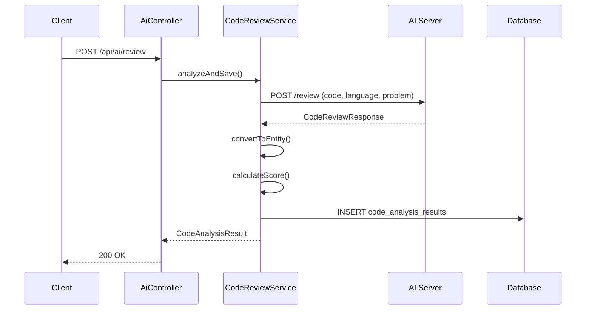
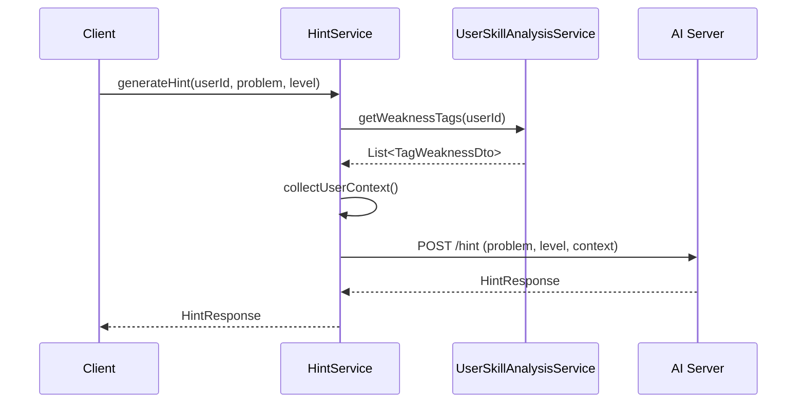
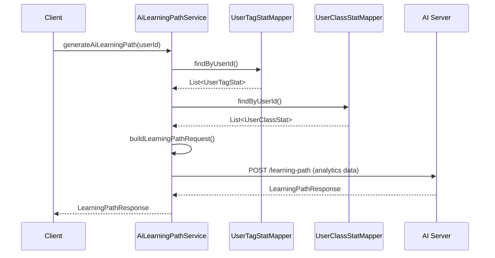
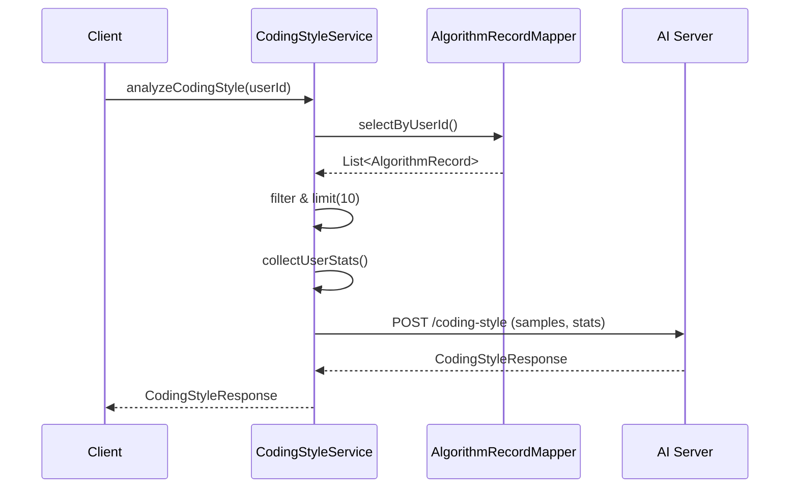
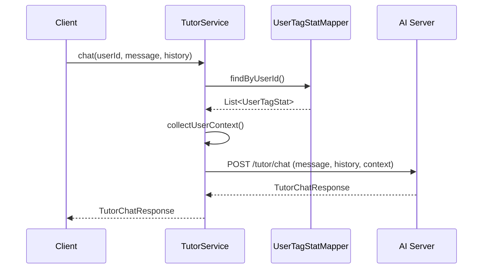

# AI 모듈 상세 문서 (AI Module Specification)

본 문서는 `Dash` 서비스의 AI 기반 기능들에 대한 상세 명세입니다.
API 엔드포인트, 서비스 로직, 데이터 플로우, 그리고 AI 서버와의 통신 규격을 정의합니다.

---

## 1. 모듈 개요 (Overview)

AI 모듈은 5가지 핵심 기능을 제공합니다:

| 기능 | 설명 | 엔드포인트 |
|------|------|------------|
| **코드 리뷰** | 알고리즘 풀이 코드 분석 및 평가 | `POST /api/ai/review` |
| **맞춤형 힌트** | 문제에 대한 레벨별 힌트 생성 | `POST /api/ai/hint` |
| **학습 경로** | AI 기반 개인화 학습 경로 추천 | `GET /api/ai/learning-path/{userId}` |
| **코딩 스타일** | MBTI 스타일 코딩 성향 분석 | `GET /api/ai/coding-style/{userId}` |
| **대화형 튜터** | 소크라테스식 AI 튜터 채팅 | `POST /api/ai/tutor/chat` |

---

## 2. 시스템 아키텍처 (Architecture)

### 2.1 컴포넌트 구조

```mermaid
graph TB
    subgraph Frontend
        UI[Dashboard UI]
    end

    subgraph Backend["Spring Boot Backend"]
        Controller[AiController]
        Services[AI Services]
        Client[AiServerClient]
        Mapper[Mappers]
    end

    subgraph AI["FastAPI AI Server"]
        Endpoints[AI Endpoints]
        Gemini[Gemini 2.5 Flash]
    end

    subgraph DB[(Database)]
        CodeAnalysis[code_analysis_results]
        UserData[user/analytics tables]
    end

    UI --> Controller
    Controller --> Services
    Services --> Client
    Services --> Mapper
    Client --> Endpoints
    Endpoints --> Gemini
    Mapper --> DB
    Mapper --> UserData
```

### 2.2 패키지 구조

```
com.ssafy.dash.ai/
├── application/           # 서비스 레이어
│   ├── CodeReviewService.java
│   ├── HintService.java
│   ├── AiLearningPathService.java
│   ├── CodingStyleService.java
│   └── TutorService.java
├── client/               # AI 서버 통신
│   ├── AiServerClient.java (interface)
│   ├── AiServerClientImpl.java
│   └── dto/
│       ├── CodeReviewRequest.java
│       ├── CodeReviewResponse.java
│       ├── HintRequest.java
│       ├── HintResponse.java
│       ├── LearningPathRequest.java
│       ├── LearningPathResponse.java
│       ├── CodingStyleRequest.java
│       ├── CodingStyleResponse.java
│       ├── TutorChatRequest.java
│       └── TutorChatResponse.java
├── domain/               # 도메인 엔티티
│   └── CodeAnalysisResult.java
├── infrastructure/       # 데이터 접근
│   └── CodeAnalysisResultMapper.java
└── presentation/         # API 컨트롤러
    └── AiController.java
```

---

## 3. API 명세 (API Specification)

### 3.1 코드 리뷰 API

#### `POST /api/ai/review`
알고리즘 풀이 코드를 AI로 분석하고 결과를 저장합니다.

**Request Body:**
```json
{
  "algorithmRecordId": 123,
  "code": "public class Solution { ... }",
  "language": "java",
  "problemNumber": "1000"
}
```

**Response:**
```json
{
  "id": 1,
  "algorithmRecordId": 123,
  "summary": "피보나치 수열을 DP로 효율적으로 구현했습니다.",
  "timeComplexity": "O(n)",
  "spaceComplexity": "O(n)",
  "complexityExplanation": "배열을 사용한 Bottom-up DP 방식",
  "patterns": ["dynamic_programming", "memoization"],
  "pitfalls": ["배열 인덱스 경계 확인 필요"],
  "improvements": ["공간 복잡도 O(1)로 최적화 가능"],
  "score": 85,
  "analyzedAt": "2025-12-12T16:00:00"
}
```

#### `GET /api/ai/review/{algorithmRecordId}`
저장된 분석 결과를 조회합니다.

---

### 3.2 맞춤형 힌트 API

#### `POST /api/ai/hint`
문제에 대한 레벨별 맞춤 힌트를 생성합니다.

**Request Body:**
```json
{
  "userId": 1,
  "problemNumber": "1000",
  "problemTitle": "A+B",
  "level": 1
}
```

**Hint Levels:**
| Level | 설명 | 도토리 비용 |
|-------|------|------------|
| 1 | 문제 유형 힌트 | 1개 |
| 2 | 접근법 제안 | 2개 |
| 3 | 상세 가이드/수도코드 | 3개 |

**Response:**
```json
{
  "level": 1,
  "hint": "이 문제는 입출력 기초 문제입니다. 두 수를 입력받아 더하면 됩니다.",
  "relatedConcepts": ["입출력", "기초 연산"],
  "encouragement": "기초를 탄탄히 다지는 것이 중요해요!",
  "nextLevelPreview": "다음 레벨에서는 구현 방법을 알려드릴게요."
}
```

---

### 3.3 학습 경로 API

#### `GET /api/ai/learning-path/{userId}`
사용자 분석 데이터 기반 AI 추천 학습 경로를 생성합니다.

**Response:**
```json
{
  "overallAssessment": "현재 Gold V 레벨로 기초가 탄탄합니다.",
  "keyStrength": "DP와 그래프 탐색에 강점",
  "primaryWeakness": "문자열 처리 알고리즘 부족",
  "personalizedAdvice": "문자열 기초 문제부터 차근차근 풀어보세요.",
  "phases": [
    {
      "phase": 1,
      "title": "문자열 기초 다지기",
      "duration": "2주",
      "focus": "KMP, 해싱 기초",
      "goals": ["문자열 문제 20개 풀기"],
      "milestones": ["Silver 문자열 문제 정복"]
    }
  ],
  "motivationalMessage": "꾸준히 하면 반드시 성장합니다! 화이팅!"
}
```

---

### 3.4 코딩 스타일 분석 API

#### `GET /api/ai/coding-style/{userId}`
사용자의 코드 패턴을 분석하여 MBTI 스타일 결과를 생성합니다.

**4축 분석:**
| 축 | 왼쪽 | 오른쪽 | 설명 |
|----|------|--------|------|
| E/I | External | Internal | 라이브러리 활용 vs 직접 구현 |
| S/N | Systematic | Intuitive | 체계적 예외처리 vs 핵심 로직 집중 |
| T/F | Time | Flow | 시간 최적화 vs 가독성 우선 |
| J/P | Judging | Perceiving | 계획적 접근 vs 유연한 실험 |

**Response:**
```json
{
  "mbtiCode": "INTJ",
  "nickname": "논리적 설계자",
  "summary": "직접 구현을 선호하고 체계적으로 접근하며 효율성을 중시합니다.",
  "axes": [
    {
      "axis": "E/I",
      "result": "I",
      "score": 70,
      "leftLabel": "외향적 코딩",
      "rightLabel": "내향적 코딩",
      "description": "라이브러리보다 직접 구현을 선호합니다."
    }
  ],
  "strengths": ["효율적 알고리즘 선택", "구조적 접근"],
  "improvements": ["다양한 라이브러리 활용 고려"],
  "compatibleStyles": "ENTJ, ISTJ",
  "advice": "때로는 검증된 라이브러리를 활용하는 것도 좋습니다."
}
```

---

### 3.5 대화형 튜터 API

#### `POST /api/ai/tutor/chat`
소크라테스 교수법 기반 AI 튜터와 채팅합니다.

**Request Body:**
```json
{
  "userId": 1,
  "message": "DP가 뭐예요?",
  "history": [
    {"role": "user", "content": "이전 질문"},
    {"role": "assistant", "content": "이전 응답"}
  ],
  "problemNumber": "1003",
  "code": "// 관련 코드 (선택)"
}
```

**Response:**
```json
{
  "reply": "DP가 어렵게 느껴질 수 있어요! 어떤 점이 어려우신가요?",
  "teachingStyle": "socratic",
  "followUpQuestions": [
    "DP를 언제 사용하는지 알고 계신가요?",
    "같은 계산을 반복한 경험이 있으신가요?"
  ],
  "conceptExplanation": "DP는 큰 문제를 작은 부분문제로 나누어 해결하는 방법입니다.",
  "encouragement": "차근차근 함께 알아가봐요! 포기하지 마세요!"
}
```

**Teaching Styles:**
| Style | 설명 |
|-------|------|
| `socratic` | 질문을 통해 스스로 깨닫도록 유도 |
| `direct` | 직접적인 설명 제공 |
| `hint` | 간접적인 힌트 제공 |

---

## 4. 서비스 로직 (Service Logic)

### 4.1 CodeReviewService



**점수 계산 로직:**
- 기본 점수: 70점
- O(1), O(log n) 복잡도: +15점
- O(n) 복잡도: +10점
- 개선점 0개: +15점
- 개선점 1-2개: +5점
- 개선점 3개 이상: -5점씩 감점

---

### 4.2 HintService



**사용자 컨텍스트:**
- 약점 태그 (상위 5개)
- 푼 문제 수
- 티어 (Bronze ~ Ruby)

---

### 4.3 AiLearningPathService



**분석 데이터 수집:**
- 태그별 강점/약점 분류 (숙련도 50% 기준)
- 클래스별 진행률
- 현재 티어 및 목표

---

### 4.4 CodingStyleService



**코드 샘플 요구사항:**
- 최소 1개 이상의 유효한 코드 필요
- 최대 10개 샘플 분석
- 런타임/메모리 정보 포함

---

### 4.5 TutorService



**대화 컨텍스트:**
- 최근 10개 메시지 히스토리 유지
- 사용자 티어/레벨 인식
- 관심 태그 기반 맞춤 설명

---

## 5. AI 서버 엔드포인트 (AI Server)

AI 서버는 FastAPI로 구현되며, Gemini 2.5 Flash 모델을 사용합니다.

| Endpoint | Method | 설명 |
|----------|--------|------|
| `/health` | GET | 헬스 체크 |
| `/review` | POST | 코드 분석 |
| `/hint` | POST | 힌트 생성 |
| `/learning-path` | POST | 학습 경로 생성 |
| `/coding-style` | POST | 코딩 스타일 분석 |
| `/tutor/chat` | POST | 튜터 채팅 |

**공통 특징:**
- `response_mime_type: application/json`
- Pydantic 스키마 기반 구조화된 출력
- 한국어 응답

---

## 6. 데이터베이스 스키마

### code_analysis_results

```sql
CREATE TABLE code_analysis_results (
    id BIGINT AUTO_INCREMENT PRIMARY KEY,
    algorithm_record_id BIGINT NOT NULL,
    summary TEXT,
    time_complexity VARCHAR(50),
    space_complexity VARCHAR(50),
    complexity_explanation TEXT,
    patterns JSON,
    algorithm_intuition TEXT,
    pitfalls JSON,
    improvements JSON,
    refactor_provided BOOLEAN DEFAULT FALSE,
    refactor_code TEXT,
    refactor_explanation TEXT,
    score INT,
    analyzed_at DATETIME,
    FOREIGN KEY (algorithm_record_id) REFERENCES algorithm_records(id)
);
```

---

## 7. 테스트 커버리지

| 서비스 | 테스트 클래스 | 테스트 수 |
|--------|--------------|----------|
| CodeReviewService | CodeReviewServiceTest | 3 |
| HintService | HintServiceTest | 2 |
| TutorService | TutorServiceTest | 2 |
| AiLearningPathService | AiLearningPathServiceTest | 2 |
| CodingStyleService | CodingStyleServiceTest | 3 |
| **Total** | | **12** |

---

## 8. 설정 (Configuration)

### application.properties

```properties
# AI Server
ai.server.base-url=http://localhost:8000
```

### AI Server (.env)

```
GOOGLE_API_KEY=your_gemini_api_key
```

---

## 9. 에러 처리

모든 AI 서버 통신 실패 시 `AiServerException`이 발생합니다.

```java
public class AiServerException extends RuntimeException {
    public AiServerException(String message, Throwable cause) {
        super(message, cause);
    }
}
```

**에러 메시지:**
- `코드 분석 요청에 실패했습니다`
- `힌트 생성 요청에 실패했습니다`
- `학습 경로 생성 요청에 실패했습니다`
- `코딩 스타일 분석 요청에 실패했습니다`
- `튜터 대화 요청에 실패했습니다`
