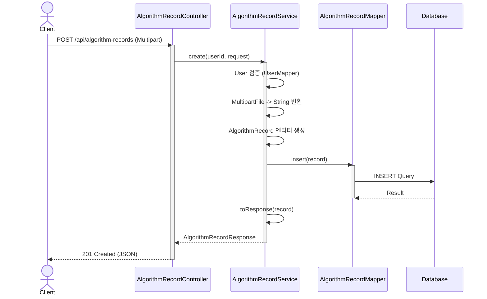

# 아키텍처 가이드 (ARCHITECTURE)

이 프로젝트는 **DDD(Domain Driven Design)** 를 바탕으로 한 계층형 아키텍처를 사용하며, 각 도메인은 동일한 네 개의 레이어(`presentation → application → domain → infrastructure`)로 구성됩니다. 도메인별 패키지를 나누고, 각 레이어 간 의존 방향을 단방향으로 유지해 응집도를 높이는 것이 목표입니다.

## 1. 패키지 구조

```
com.ssafy.dash
├── algorithm/
│   ├── presentation/    # HTTP · UI 어댑터 (Controller, DTO, security adapter)
│   ├── application/     # Use case (Command/Result, 서비스)
│   ├── domain/          # Aggregate, VO, Repository Port
│   └── infrastructure/  # MyBatis Mapper, 외부 연동 어댑터
├── board/
├── oauth/
│   └── presentation/security/  # Spring Security 어댑터 (CustomOAuth2User 등)
├── user/
├── common/              # 테스트 픽스처, 공용 유틸리티
└── config/              # 전역 설정 (SecurityConfig, Swagger 등)
```

- 모든 계층 간 의존은 **같은 도메인 내부에서 상위 레이어 → 하위 레이어 방향으로만 허용**됩니다.
- `common`, `config` 패키지는 도메인에 속하지 않는 공유 모듈이며, 도메인 계층에서 `config` 를 직접 참조하지 않습니다.

## 2. 레이어 역할

### 2.1. Presentation Layer

- REST Controller, HTTP DTO, Spring Security 어댑터 등 인터페이스 어댑터 역할을 담당합니다.
- 프레임워크에 강하게 의존할 수 있는 영역으로, `oauth.presentation.security.CustomOAuth2User` / `CustomOAuth2UserService` 같이 OAuth2 사용자 정보를 애플리케이션 계층 DTO(`OAuthLoginResult`)로 투영하는 어댑터가 포함됩니다.
- 비즈니스 의사결정 로직은 넣지 않으며, 요청/응답 변환과 인증 컨텍스트 확립에 집중합니다.

### 2.2. Application Layer

- 도메인 모델을 활용해 유스케이스를 조합하는 서비스, Command/Result DTO, 이벤트 퍼블리셔 등이 위치합니다.
- 트랜잭션 경계를 선언하고, 필요한 Port를 주입받아 도메인/인프라를 호출합니다.
- `UserService`, `OAuthTokenService` 등이 여기에 해당합니다.

### 2.3. Domain Layer

- 순수 자바 객체로 구성된 엔티티, VO, 정책 로직, 도메인 서비스가 들어갑니다.
- 외부 기술 스택에 의존하지 않으며, 필요 시 Repository Port 인터페이스만 정의합니다.

### 2.4. Infrastructure Layer

- MyBatis Mapper, 외부 API 클라이언트, 파일 시스템 어댑터 등 실제 구현체가 위치합니다.
- 도메인에서 정의한 Port를 구현해 Application Layer에 주입됩니다.

## 3. 보안 어댑터 설계

- Spring Security는 인터페이스 어댑터에 해당하므로 **OAuth 관련 커스텀 사용자/서비스 구현은 `oauth.presentation.security` 패키지**에서 관리합니다.
- `CustomOAuth2User` 는 `OAuth2User` 를 감싼 뒤 애플리케이션 계층의 `OAuthLoginResult` 를 보존해 컨트롤러가 도메인 식별자와 흐름(`AuthFlowType`)을 안전하게 읽도록 합니다.
- `CustomOAuth2UserService` 는 OAuth provider 응답을 파싱해 `OAuthLoginResult` 로 변환하고, `AuthenticationPrincipal` 로 주입될 수 있는 `CustomOAuth2User` 를 반환합니다.
- 이 구조 덕분에 Presentation Layer가 인프라 구현에 직접 의존하지 않고도 인증 정보를 활용할 수 있으며, ArchUnit 규칙도 자연스럽게 충족합니다.

## 4. 데이터 흐름 예시 (알고리즘 기록 생성)



## 5. 아키텍처 규칙 검증

- `ArchitectureRulesTest` (테스트 로그에 "아키텍처 규칙 테스트"로 표시) 가 모든 계층 의존성/패키지 명명 규칙을 ArchUnit으로 검사합니다.
- 전체 테스트를 실행하면 자동으로 검증되며, 단독 실행이 필요하다면 아래 명령을 사용할 수 있습니다.

```powershell
PS C:\dash\backend> .\mvnw.cmd test -Dtest=*ArchitectureRulesTest
```

- 새 클래스를 추가할 때는 레이어 패키지를 올바르게 지정하고, Presentation Layer에서 Infrastructure 클래스를 직접 참조하지 않도록 주의하세요. 위반 시 테스트가 즉시 실패합니다.
