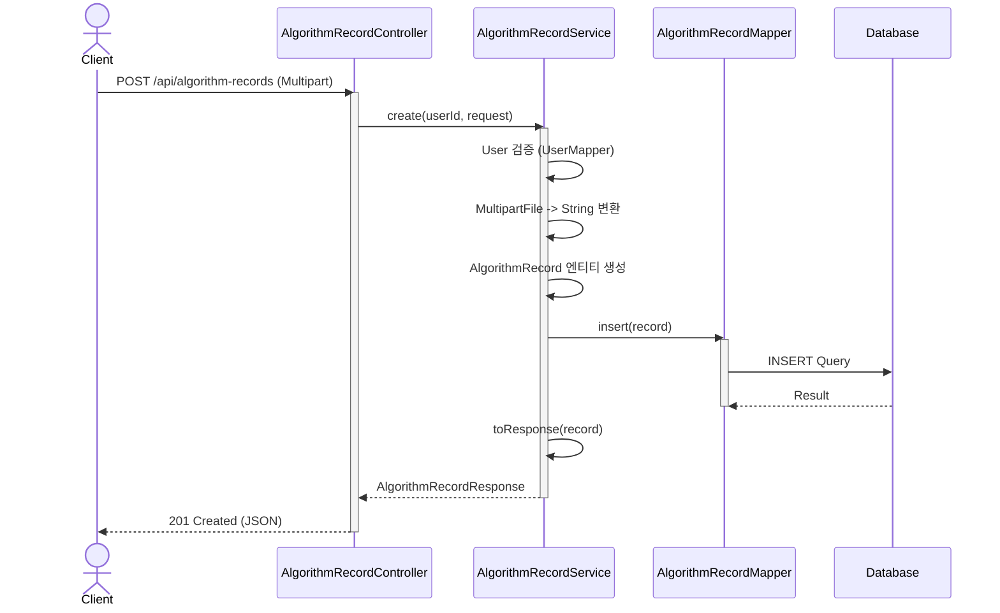

# 아키텍처 가이드 (ARCHITECTURE)

이 프로젝트는 **DDD(Domain Driven Design)** 개념을 차용한 계층형 아키텍처(Layered Architecture)를 따릅니다.  
도메인별로 패키지를 분리하여 응집도를 높이고 결합도를 낮추는 것을 목표로 합니다.

## 1. 패키지 구조

기능(도메인) 중심으로 최상위 패키지를 구성합니다.

```
com.ssafy.dash
├── algorithm/       # 알고리즘 도메인
│   ├── controller/  # 웹 계층 (REST API)
│   ├── service/     # 비즈니스 로직
│   ├── domain/      # 도메인 엔티티 (POJO)
│   ├── dto/         # 데이터 전송 객체 (Request/Response)
│   ├── mapper/      # 데이터 접근 계층 (MyBatis)
│   └── exception/   # 도메인별 예외
├── board/           # 게시판 도메인
├── user/            # 사용자 도메인
├── common/          # 공통 유틸리티 및 설정
└── config/          # Spring 설정 (Security, Swagger 등)
```

## 2. 계층별 역할

### 2.1. Controller (Web Layer)

- **역할**: HTTP 요청을 받아 적절한 Service를 호출하고, 결과를 응답으로 변환합니다.
- **특징**:
  - 비즈니스 로직을 포함하지 않습니다.
  - DTO를 통해 데이터를 주고받습니다.
  - `@RestController`, `@RequestMapping` 등을 사용합니다.

### 2.2. Service (Business Layer)

- **역할**: 실제 비즈니스 로직을 수행합니다. (트랜잭션 관리, 데이터 가공 등)
- **특징**:
  - `@Transactional`을 사용하여 데이터 무결성을 보장합니다.
  - Mapper를 호출하여 DB 작업을 수행합니다.
  - 도메인 객체를 DTO로 변환하여 반환합니다.

### 2.3. Domain (Entity)

- **역할**: 핵심 비즈니스 데이터를 담고 있는 객체입니다.
- **특징**:
  - 데이터베이스 테이블과 1:1로 매핑되는 경우가 많습니다.
  - 비즈니스 로직을 가질 수 있으나, 현재는 주로 데이터 홀더(POJO) 역할을 합니다.
  - Lombok 사용을 지양하고 Getter/Setter를 명시적으로 작성하는 스타일을 유지합니다.

### 2.4. Mapper (Persistence Layer)

- **역할**: 데이터베이스와 상호작용합니다.
- **특징**:
  - MyBatis 인터페이스를 사용합니다.
  - SQL 쿼리는 XML 파일이나 어노테이션으로 관리됩니다.

### 2.5. DTO (Data Transfer Object)

- **역할**: 계층 간 데이터 교환을 담당합니다.
- **특징**:
  - `CreateRequest`, `UpdateRequest`, `Response` 등으로 명확히 구분하여 사용합니다.
  - 엔티티가 외부로 직접 노출되는 것을 방지합니다.

## 3. 데이터 흐름 예시 (알고리즘 기록 생성)


