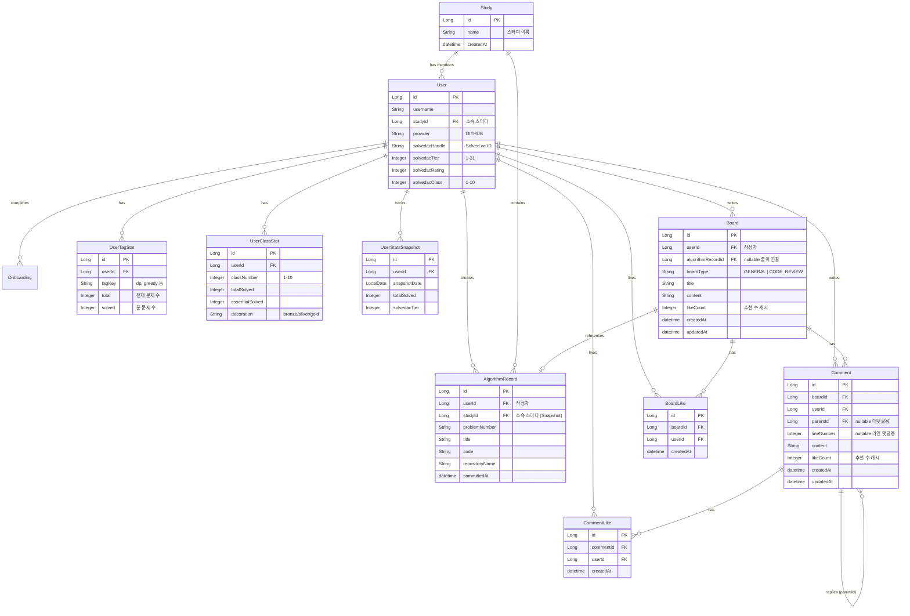
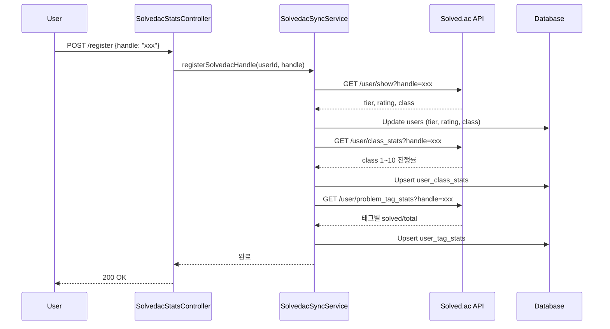
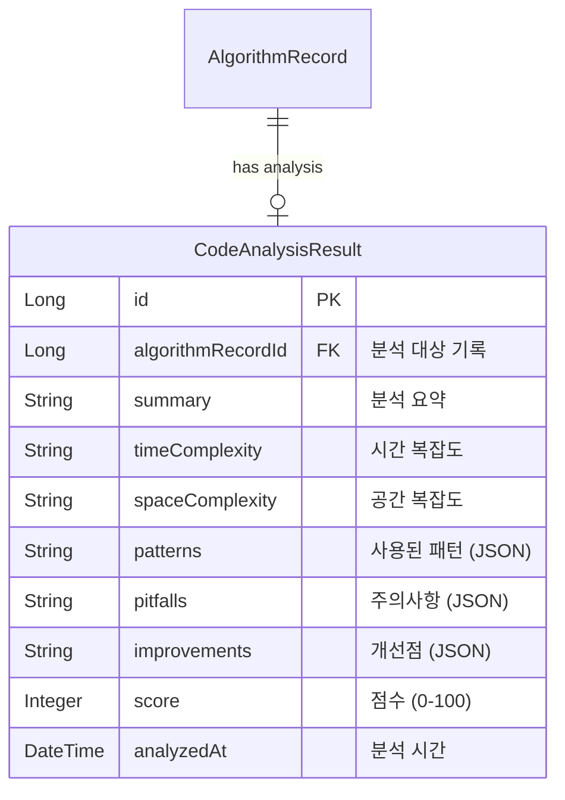

# 도메인 모델 및 아키텍처 (Domain Model & Architecture)

본 문서는 `Dash` 서비스의 핵심 도메인 모델, 데이터 흐름, 그리고 주요 API 엔드포인트를 기술합니다.

## 1. 도메인 관계도 (ERD Overview)

## 2. 주요 엔티티 (Key Entities)

### 2.1 Study (스터디)
알고리즘 스터디 그룹을 나타내는 최상위 논리 단위입니다.
- **역할**: 회원들의 그룹핑.
- **특징**:
    - `repositoryName`을 가지지 **않습니다**. (리포지토리는 회원이 각자 소유)
    - 회원은 오직 하나의 스터디에만 소속될 수 있습니다 (N:1).

### 2.2 User (회원)
서비스를 이용하는 개별 사용자입니다.
- **주요 필드**:
    - `studyId`: 현재 소속된 스터디의 ID.
    - `provider`: OAuth 제공자 (현재 GitHub).
    - **Active Repository**: `Onboarding` 정보를 통해 관리되는 하나의 **스터디 활동용 리포지토리**. (모든 커밋은 이 리포지토리에서 발생)

### 2.3 AlgorithmRecord (알고리즘 풀이 기록)
GitHub에서 커밋된 알고리즘 문제 풀이 내역입니다.
- **주요 필드**:
    - `userId`: 문제를 푼 회원.
    - `studyId`: **기록 생성 시점**에 회원이 소속된 스터디. (스터디 이동 시에도 과거 기록 보존을 위해 스냅샷 형태로 저장)
    - `problemNumber`, `title`, `code`: 문제 메타데이터 및 코드.
    - `committedAt`: 실제 커밋 시간.

### 2.4 UserTagStat (태그별 통계)
Solved.ac에서 동기화된 태그별 문제 풀이 통계입니다.
- **주요 필드**:
    - `tagKey`: 알고리즘 태그 키 (dp, greedy 등).
    - `solved`: 해당 태그에서 푼 문제 수.
    - `total`: 해당 태그의 전체 문제 수.
- **계산 필드**: `masteryLevel`, `solvedToNextLevel` 등 (엔티티 내 계산)

### 2.5 UserClassStat (클래스별 통계)
Solved.ac Class 1-10에 대한 진행 현황입니다.
- **주요 필드**:
    - `classNumber`: 클래스 번호 (1-10).
    - `essentials`, `essentialSolved`: 에센셜 문제 현황.
    - `decoration`: 획득한 장식 (bronze/silver/gold).

### 2.6 UserStatsSnapshot (통계 스냅샷)
성장 추세 분석을 위한 일별 통계 스냅샷입니다.
- **용도**: 과거 특정 시점의 통계와 현재를 비교하여 성장률 분석.
- **저장 주기**: 일 1회 또는 분석 요청 시.

### 2.7 Board (게시글) - 신규
알고리즘 풀이를 공유하는 게시판 게시글입니다.
- **주요 필드**:
    - `algorithmRecordId`: 연결된 알고리즘 풀이 기록 (nullable).
    - `boardType`: 게시글 유형 (GENERAL, CODE_REVIEW).
    - `likeCount`: 추천 수 (성능을 위한 캐시).
- **특징**: 풀이 코드를 첨부하면 코드 뷰어에서 라인별 댓글 가능.

### 2.8 Comment (댓글) - 신규
게시글에 달리는 댓글입니다. 라인 댓글과 대댓글을 지원합니다.
- **주요 필드**:
    - `parentId`: 부모 댓글 ID (null = 최상위 댓글, 1단계 대댓글만 허용).
    - `lineNumber`: 코드 라인 번호 (null = 일반 댓글).
    - `likeCount`: 추천 수.
- **규칙**: 대댓글의 대댓글은 서비스에서 거부됨.

### 2.9 BoardLike / CommentLike (추천) - 신규
게시글/댓글 추천 기록입니다.
- **복합 유니크**: `(boardId, userId)` 또는 `(commentId, userId)`.
- **연동**: 추천/취소 시 해당 엔티티의 `likeCount` 필드가 자동 동기화됨.

---

## 3. 데이터 흐름 (Data Flows)

### 3.1 문제 풀이 자동 기록 (GitHub Webhook Flow)

사용자가 본인의 GitHub 리포지토리에 코드를 푸시하면, 시스템이 이를 감지하여 대시보드에 업데이트하는 과정입니다.

1.  **User Push**: 사용자가 등록된 리포지토리에 알고리즘 소스 코드를 `push` 합니다.
2.  **Webhook Trigger**: GitHub가 `Dash` 백엔드의 `/api/github/events` 엔드포인트로 `push` 이벤트를 전송합니다.
3.  **Event Queuing**: `GitHubWebhookController`가 이벤트를 받아 `github_push_events` 테이블에 저장(Queueing)하고 즉시 응답합니다 (Async 처리).
4.  **Worker Process**:
    *   `GitHubPushEventWorker`가 주기적으로 대기 중인 이벤트를 조회합니다.
    *   이벤트의 커밋 내용을 분석하여 문제 번호, 제목 등을 추출합니다.
    *   **중요**: 해당 User 정보를 조회하여, 현재 소속된 `studyId`를 가져옵니다.
5.  **Record Save**: `AlgorithmRecord`를 생성하여 DB에 저장합니다. 이때 `user_id`와 `study_id`가 함께 저장됩니다.

### 3.2 Solved.ac 통계 동기화 (Solvedac Sync Flow)

사용자의 Solved.ac 핸들을 등록하면 태그/클래스별 통계를 동기화합니다.

### 3.3 대시보드 조회 (Dashboard View)

1.  프론트엔드에서 스터디 대시보드 접속 시, API를 호출합니다.
2.  백엔드는 `AlgorithmRecord` 테이블에서 해당 `study_id`를 가진 모든 레코드를 최신순으로 조회합니다.
3.  조회된 데이터를 바탕으로 문제 풀이 현황을 시각화합니다.

---

## 4. 주요 API 엔드포인트 (Key Endpoints)

현재 구현되어 있거나 핵심적인 엔드포인트 목록입니다.

### 4.1 기존 API

| Controller | Method | URL | Description |
| :--- | :--- | :--- | :--- |
| **GitHubWebhook** | `POST` | `/api/github/events` | GitHub 웹훅 수신 및 이벤트 큐 적재 |
| **AlgorithmRecord** | `GET` | `/api/algorithm/records` | (Admin/Debug) 전체 알고리즘 기록 조회 |
| **AlgorithmRecord** | `GET` | `/api/algorithm/records/users/{userId}` | 특정 회원의 알고리즘 기록 조회 |
| **Onboarding** | `POST` | `/api/onboarding/verify` | 리포지토리 검증 및 웹훅 설정 |

### 4.2 Solved.ac 통계 API (신규)

| Controller | Method | URL | Description |
| :--- | :--- | :--- | :--- |
| **SolvedacStats** | `POST` | `/api/users/{id}/solvedac/register` | Solved.ac 핸들 등록 및 초기 동기화 |
| **SolvedacStats** | `POST` | `/api/users/{id}/solvedac/sync` | 통계 재동기화 |
| **SolvedacStats** | `GET` | `/api/users/{id}/solvedac/stats` | 태그별 통계 조회 |
| **SolvedacStats** | `GET` | `/api/users/{id}/solvedac/class-stats` | 클래스별 통계 조회 |

### 4.3 사용자 분석 API (신규)

| Controller | Method | URL | Description |
| :--- | :--- | :--- | :--- |
| **Analysis** | `GET` | `/api/users/{id}/analysis/summary` | 종합 스킬 요약 |
| **Analysis** | `GET` | `/api/users/{id}/analysis/strengths` | 강점 태그 TOP N |
| **Analysis** | `GET` | `/api/users/{id}/analysis/weaknesses` | 약점 태그 분석 |
| **Analysis** | `GET` | `/api/users/{id}/analysis/recommended-tags` | 추천 학습 태그 |
| **Analysis** | `GET` | `/api/users/{id}/analysis/balance` | 학습 밸런스 분석 |
| **Analysis** | `GET` | `/api/users/{id}/analysis/difficulty` | 난이도(클래스) 분포 |
| **Analysis** | `GET` | `/api/users/{id}/analysis/learning-path` | 맞춤 학습 경로 추천 |
| **Analysis** | `GET` | `/api/users/{id}/analysis/growth` | 성장 추세 분석 |
| **Analysis** | `POST` | `/api/users/{id}/analysis/snapshot` | 통계 스냅샷 생성 |

### 4.4 AI API (신규)

| Controller | Method | URL | Description |
| :--- | :--- | :--- | :--- |
| **AI** | `POST` | `/api/ai/review` | 코드 분석 요청 |
| **AI** | `GET` | `/api/ai/review/{algorithmRecordId}` | 분석 결과 조회 |
| **AI** | `POST` | `/api/ai/hint` | 레벨별 맞춤 힌트 생성 |
| **AI** | `GET` | `/api/ai/learning-path/{userId}` | AI 개인화 학습 경로 |
| **AI** | `GET` | `/api/ai/coding-style/{userId}` | MBTI 스타일 코딩 분석 |
| **AI** | `POST` | `/api/ai/tutor/chat` | 대화형 AI 튜터 |

> **상세 문서**: AI 모듈의 상세 명세는 [AI_MODULE.md](./AI_MODULE.md)를 참고하세요.

---

## 5. AI 도메인 엔티티 (AI Entities)

### 5.1 CodeAnalysisResult (코드 분석 결과)

AI가 분석한 코드 리뷰 결과를 저장합니다.

**주요 필드:**
- `summary`: AI가 생성한 코드 분석 요약
- `timeComplexity`, `spaceComplexity`: 복잡도 분석 (예: "O(n log n)")
- `patterns`: 사용된 알고리즘 패턴 (JSON 배열)
- `score`: 종합 점수 (0-100)

