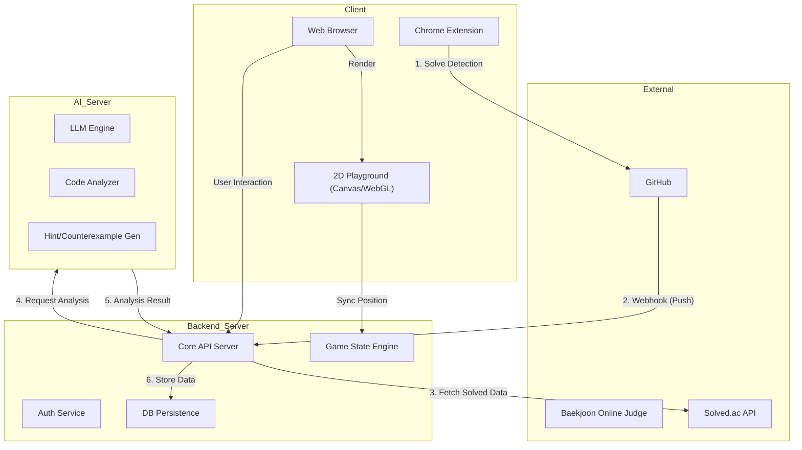

# 서비스 상세 기획서 (Service Specification)

본 문서는 `Dash` 서비스의 확장된 기능, 사용자 경험(UX) 흐름, 그리고 시스템 아키텍처를 정의합니다.
개발 팀원 간의 비전 공유 및 기술적 의사결정의 기준이 됩니다.

---

## 1. 서비스 개요 (Overview)

**Dash**는 알고리즘 스터디를 위한 **Gamified All-in-One Platform**입니다.
단순한 문제 풀이 기록을 넘어, AI 기반의 분석, 스터디 공용 재화(도토리), 그리고 2D 메타버스 공간(Playground)을 통해 몰입감 있는 성장 경험을 제공합니다.

### 핵심 철학
*   **Data-Driven Growth**: Solved.ac 데이터와 AI 분석을 기반으로 개인별 맞춤 성장을 지원합니다.
*   **Collaborative Economy**: 문제를 풀면 스터디 전체가 부유해지고, 어려울 땐 공동의 자산으로 힌트를 얻습니다.
*   **Immersive Experience**: 딱딱한 대시보드를 넘어, 내 캐릭터로 탐험하는 직관적인 학습 공간을 제공합니다.

---

## 2. 사용자 흐름 (User Flow)

### 2.1 가입 및 분석 (Onboarding Phase 1)
1.  **회원가입**: 소셜 로그인 등을 통해 가입합니다.
2.  **Solved.ac 연동**: 사용자가 본인의 `Solved.ac ID`를 입력합니다.
3.  **AI 분석**:
    *   백엔드가 Solved.ac API를 통해 풀이 데이터를 수집합니다.
    *   AI 엔진이 사용자의 강점/약점, 주력 언어, 성향을 분석하여 DB에 저장합니다.
4.  **스터디 매칭**: 분석된 데이터를 바탕으로 적합한 스터디를 추천받거나, 새로운 스터디를 생성합니다.

### 2.2 기술셋 연동 (Onboarding Phase 2)
스터디 소속 후, 실제 활동을 위한 설정을 진행합니다.
1.  **확장 프로그램 설치**: 백준 문제 풀이 감지를 위한 브라우저 익스텐션을 설치합니다.
2.  **리포지토리 연결**: GitHub 리포지토리를 생성하거나 연결하고, 웹훅(Webhook)을 자동 설정합니다.

### 2.3 학습 및 피드백 (Study Cycle)
1.  **문제 풀이 (Solve)**: 백준에서 문제를 풀고 정답을 맞춥니다.
2.  **자동 기록**: 익스텐션이 제출을 감지하여 GitHub에 자동 Push 합니다.
3.  **분석 및 시각화**:
    *   Webhook이 백엔드로 이벤트를 전달합니다.
    *   백엔드는 코드를 AI 서버로 전송하여 **복잡도, 효율성, 코드 스타일**을 분석합니다.
    *   대시보드에 **카드 형태**로 풀이 내역과 AI 분석 결과가 시각화됩니다.
4.  **반례 찾기 (Debug)**:
    *   실패한 코드(카드)를 클릭하면, AI가 해당 로직의 **반례(Counterexample)를** 찾아 알려줍니다.

---

## 3. 도토리 경제 시스템 (Acorn Economy)

스터디 활동의 동기를 부여하는 **공용 재화 시스템**입니다.

### 3.1 획득 (Earning)
*   **조건**: 알고리즘 문제 정답 제출 시 1개 적립 (기본).
*   **검증 메커니즘**:
    *   Git Commit Message Parsing: 메시지에 포함된 실행 시간(ms)과 메모리(kb) 정보를 파싱합니다.
    *   **실패 판단**: 메모리/시간 값이 `-1`이거나 실패 키워드가 있는 경우 적립 제외.
*   **공유 자산**: 획득한 도토리는 개인 소유가 아닌 **스터디 금고(Shared Vault)에** 쌓입니다.

### 3.2 소비 (Spending) - AI Hint
*   **용도**: 안 풀리는 문제에 대해 AI에게 힌트를 요청할 때 사용합니다.
*   **비용 (Cost Tier)**:
    *   **Level 1 (단순 힌트)**: 1 도토리
    *   **Level 2 (접근법 제안)**: 2 도토리
    *   **Level 3 (수도 코드/상세 가이드)**: 3 도토리
*   **로그 (Audit Log)**: "누가(Who), 언제(When), 무엇을 위해(Why), 얼마를(Amount)" 썼는지 투명하게 기록됩니다.

---

## 4. 게이미피케이션 공간 (Playground)

2D 아이소메트릭(Isometric) 뷰로 구현된 **유사 메타버스** 인터페이스입니다.

### 4.1 공간 구성 (Zones)
1.  **도토리 창고 (Acorn Warehouse)**:
    *   중앙 광장. 스터디가 모은 도토리의 개수를 시각적으로 표현 (많을수록 화려해짐).
2.  **시련의 탑 (Trial Tower)**:
    *   삼성 역량테스트 대비 코스 (IM / A형 / B형 층별 구성).
3.  **랜덤 디펜스 (Random Defense)**:
    *   실버/골드 등 난이도별 랜덤 문제 디펜스 게임.
4.  **학습관 (Study Hall)**:
    *   유형별(DP, Greedy, BFS 등) 알고리즘 학습 로드맵.

### 4.2 사용자 경험 (UX/Tech)
*   **이동 (Navigation)**: 웹 상단 헤더 메뉴를 통해 즉시 해당 Zone으로 이동 가능.
*   **캐릭터 (Avatar)**: 내 캐릭터는 로컬(Client-side)에서 부드럽게 움직이며 최적화.
*   **실시간 위치 공유 (Presence)**:
    *   스터디원의 아이콘이 그들이 **마지막으로 접속한(혹은 현재 위치한) 구역**에 표시됩니다.
    *   예: "철수는 현재 시련의 탑 A형 도전 중"

### 4.3 정복 시스템 (Conquest)
*   각 오브젝트(문제집)는 정복도에 따라 시각적 변화가 일어납니다.
*   **평가**: 문제별 3-Star Rating (시간 복잡도, 코드 길이 등 기준).

---

## 5. 시스템 아키텍처 (System Architecture)

### 데이터베이스 모델링 (Draft)

*   **AcornLog**: `id, study_id, user_id, amount (+/-), reason, created_at`
*   **MemberAnalysis**: `user_id, weak_types(JSON), strong_types(JSON), solved_tier, recommended_problems`
*   **DungeonProgress**: `user_id, dungeon_type(TOWER/DEFENSE), current_level, stars(JSON)`
*   **StudyLocation**: `user_id, zone_id, last_active_at`

---

## 6. 개발 로드맵 제안 (Implementation Phases)

1.  **Phase 1 (Core)**: ✅ **완료** - Solved.ac 연동 가입, AI 분석 파이프라인 구축.
    - Solved.ac API 클라이언트 구현
    - 태그/클래스별 통계 동기화
    - 사용자 스킬 분석 서비스 (강점/약점/밸런스/난이도/학습경로/성장추세)
    - 9개 분석 API 엔드포인트 구현
2.  **Phase 2 (AI Integration)**: ✅ **완료** - AI 기반 코드 분석 및 튜터링 시스템.
    - 코드 리뷰 통합 (`POST /api/ai/review`)
    - 맞춤형 힌트 시스템 (`POST /api/ai/hint`)
    - AI 개인화 학습 경로 (`GET /api/ai/learning-path/{userId}`)
    - MBTI 스타일 코딩 분석 (`GET /api/ai/coding-style/{userId}`)
    - 대화형 AI 튜터 (`POST /api/ai/tutor/chat`)
    - 상세 문서: [AI_MODULE.md](./AI_MODULE.md)
3.  **Phase 3 (Dashboard)**: 웹훅 -> AI 분석 -> 대시보드 카드 시각화 & 반례 찾기.
4.  **Phase 4 (Economy)**: 도토리 적립(파싱) 및 소비(힌트) 로직 구현.
5.  **Phase 5 (Playground)**: 2D 맵 에셋 적용, 위치 동기화, 던전 UI 연동.

