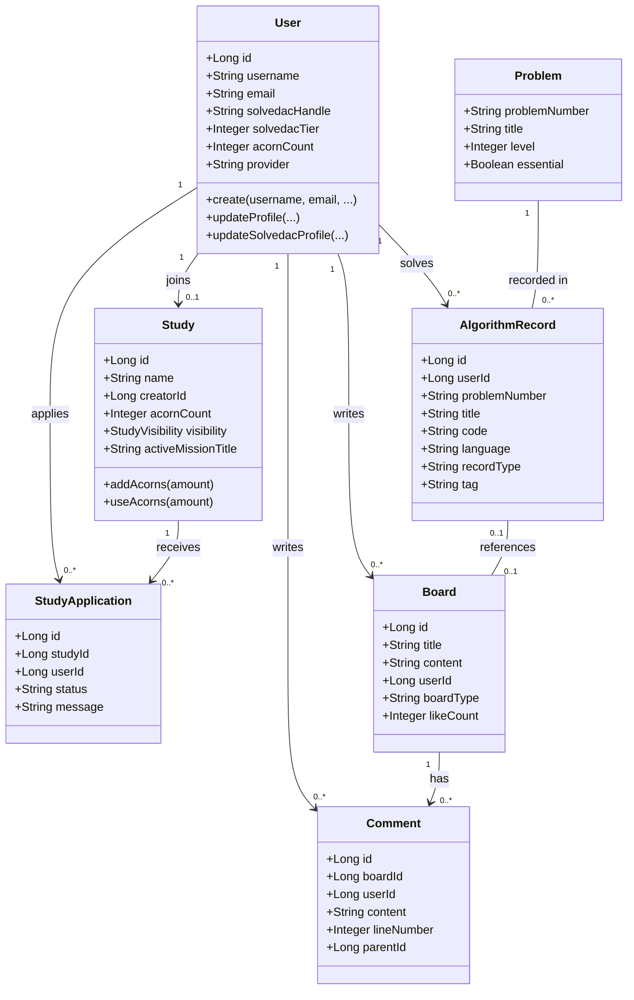

# 3. Class Diagram (클래스 다이어그램)

## 3.1 다이어그램

## 3.2 주요 클래스 설명
- **User**: 시스템의 핵심 엔티티로, 사용자 기본 정보와 Solved.ac 연동 정보, 학습 통계 등을 관리한다.
- **Study**: 스터디 그룹을 나타내며, 멤버십, 도토리(재화), 진행 중인 미션 정보를 포함한다.
- **AlgorithmRecord**: 사용자가 푼 알고리즘 문제에 대한 기록으로, 제출 코드, 언어, 풀이 시간 등을 저장한다.
- **Board**: 커뮤니티 게시글 엔티티로, 일반 게시글과 질문 게시글 등을 구분한다.
- **Comment**: 게시글에 달리는 댓글이며, `lineNumber` 필드를 통해 특정 코드 라인에 대한 피드백(코드 리뷰) 기능을 지원한다.