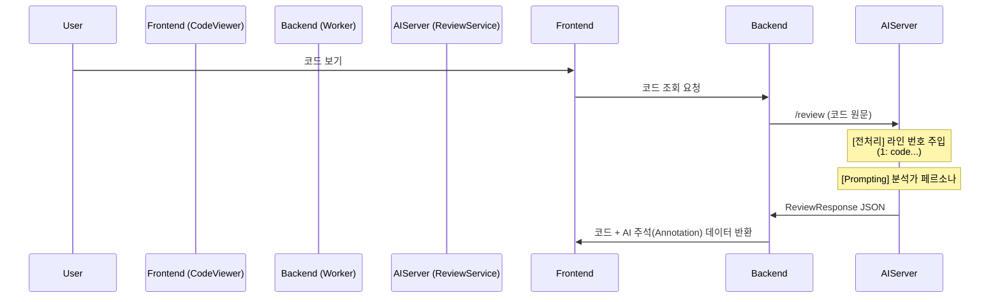
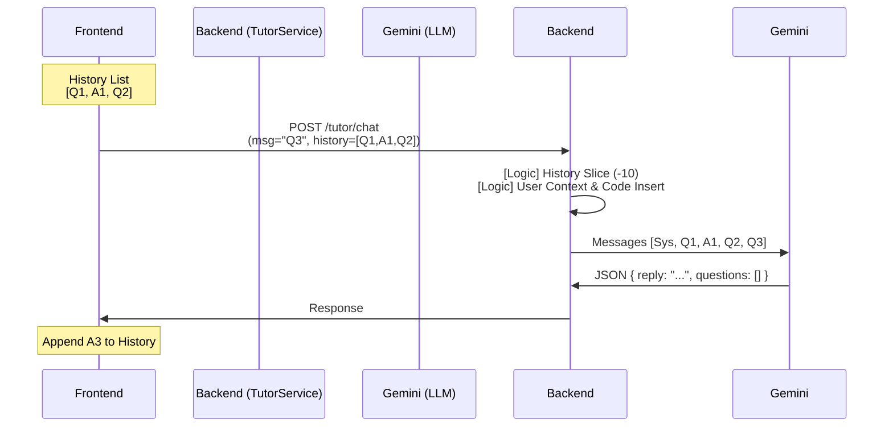
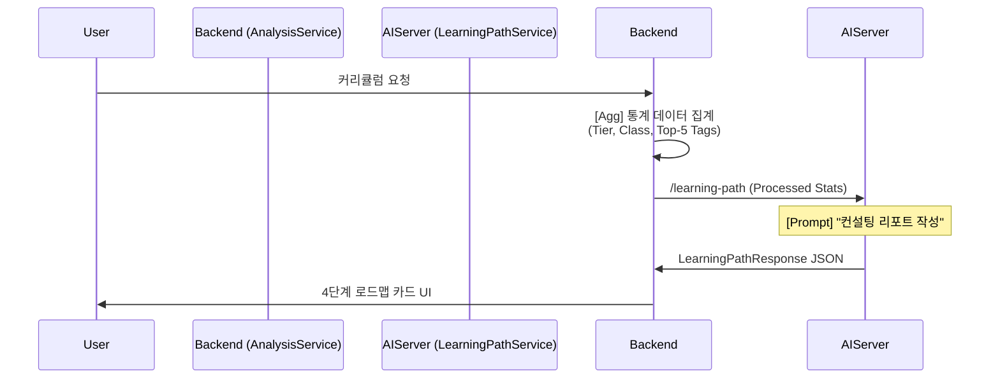
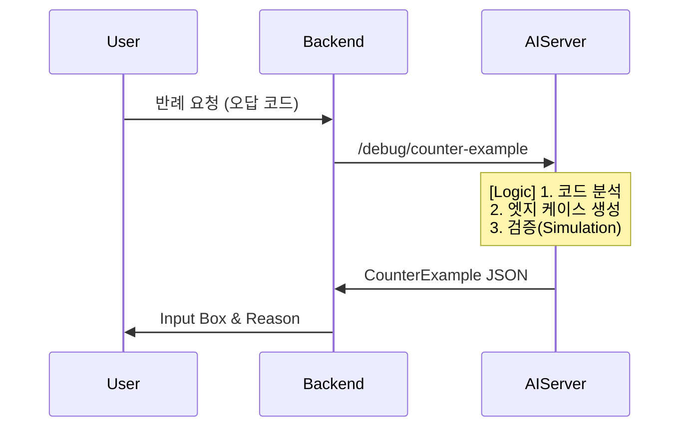

# AI 기능 기술 분석 보고서
**(AI Feature Technical Specification)**

---

## 1. 개요 (Overview)
### 1.1 문서 목적
본 문서는 **Dash 알고리즘 학습 플랫폼**에 탑재된 핵심 AI 기능의 기술적 구현 상세, 내부 로직, 그리고 데이터 처리 흐름을 정의합니다. 개발팀, 기획팀, 그리고 유지보수 담당자가 AI 시스템의 작동 원리를 명확히 이해하고, 향후 고도화 및 최적화의 기준(Baseline)으로 삼는 것을 목적으로 합니다.

### 1.2 분석 범위
본 보고서는 다음 4가지 핵심 AI 기능을 다룹니다:
-   **AI 코드 리뷰**: 제출 코드 정적/논리 분석
-   **AI 튜터 채팅**: 소크라테스식 학습 가이드
-   **학습 경로 추천**: 데이터 기반 커리큘럼 설계
-   **반례 생성기**: 적대적 테스팅 및 오류 검증

또한, 이를 지탱하는 공통 기술 스택과 아키텍처 의사결정(Technical Decisions)에 대해서도 상세히 기술합니다.

---

## 목차 (Table of Contents)
1.  [개요 (Overview)](#1-개요-overview)
2.  [기술적 의사결정 (Technical Architecture Decisions)](#3-기술적-의사결정-technical-architecture-decisions)
3.  [AI 코드 리뷰 (AI Code Review)](#4-ai-코드-리뷰-ai-code-review)
4.  [AI 튜터 채팅 (AI Tutor Chat)](#5-ai-튜터-채팅-ai-tutor-chat)
5.  [학습 경로 추천 (Learning Path Recommendation)](#6-학습-경로-추천-learning-path-recommendation)
6.  [반례 생성기 (Counter Example Generator)](#7-반례-생성기-counter-example-generator)

---

## 3. 기술적 의사결정 (Technical Architecture Decisions)
본 프로젝트의 AI 아키텍처 설계 과정에서 이루어진 주요 기술적 의사결정과 그 배경입니다.

### 3.1 No-Framework 채택 (LangChain/LangGraph 미사용)
-   **Decision**: LangChain이나 LangGraph와 같은 고수준 프레임워크를 배제하고, `google-genai` SDK를 직접 사용하는 **Pure Implementation** 방식을 채택했습니다.
-   **Rationale**:
    1.  **정밀한 토큰 제어**: 튜터 서비스의 History Slicing(10개), Code Truncation(2000자) 등 저수준 제어를 명확히 수행하기 위함입니다.
    2.  **오버헤드 제거**: 단순한 Request-Response 구조에서 프레임워크 오버헤드를 제거하여 응답 속도를 최적화했습니다.
    3.  **명시적 파이프라인**: 데이터 흐름을 코드 레벨에서 직관적으로 파악하여 디버깅 용이성을 확보했습니다.

### 3.2 Gemini 3 모델 및 Thinking Mode 도입
-   **Decision**: `Gemini 3 Flash Preview` 모델 선정 및 `thinking_level="high"` 적용.
-   **Rationale**:
    1.  **Logical Accuracy**: 내부 사고(Chain of Thought) 과정을 통해 코드 분석의 논리적 정확도를 비약적으로 향상시켰습니다.
    2.  **Simulation Capability**: 반례 생성 시, 모델이 내부적으로 코드를 가상 실행(Trace)하여 검증할 수 있습니다.

### 3.3 Native Structured Output (Pydantic Integration)
-   **Decision**: Pydantic 모델을 활용한 Schema Forced Generation 사용.
-   **Rationale**:
    1.  **Stability**: 100% 타입 안전한 JSON 응답을 보장하여 파싱 에러로 인한 재시도(Retry) 로직을 제거했습니다.
    2.  **Maintainability**: Python 클래스 정의가 곧 API 명세서 역할을 하여 문서 관리 비용을 절감했습니다.

---

## 4. AI 코드 리뷰 (AI Code Review)
*제출된 코드의 복잡도 및 핵심 로직 자동 분석 (Line-by-Line)*

### 4.1 서비스 로직 상세 (Internal Logic)
**Service**: `ReviewService` (`review_service.py`)

1.  **Line Number Injection**: 원본 코드 각 줄에 `"{line_number}: "` 형식의 인덱스를 강제로 주입하여, AI가 특정 라인을 정확히 참조(Reference)할 수 있도록 전처리합니다.
2.  **Prompt Formatting**: 코드 전문을 마크다운 블록으로 감싸고, 기술적 분석가(Expert Analyst) 페르소나를 주입합니다.

### 4.2 데이터 플로우 (Data Flow)

### 4.3 데이터 스키마 (Data Schema)
**Response (`ReviewResponse`)**
- `algorithm` (Object): 패턴(`patterns`) 및 직관적 설명(`intuition`)
- `keyBlocks` (List): **핵심 로직 블록**. `startLine`, `endLine`으로 프론트엔드 하이라이팅 지원
- `complexity` (Object): 정규화된 시간/공간 복잡도 표기 (`O(N)`, `O(1)` 등)

---

## 5. AI 튜터 채팅 (AI Tutor Chat)
*답을 알려주는 대신, 스스로 생각하게 만드는 Client-managed Multi-turn 튜터*

### 5.1 서비스 로직 상세 (Internal Logic)
**Service**: `TutorChatService` (`tutor_chat_service.py`)

1.  **Context Construction**:
    -   **Token Optimization**: 코드는 앞부분 **2000자**까지만 절삭(Truncation)하여 전송합니다.
    -   **Dynamic Status Prompting**: 문제 풀이 상태(Solved/Wrong)에 따라 칭찬/격려 또는 디버깅 힌트 제공 모드로 자동 전환됩니다.
2.  **History Management**:
    -   **Stateless Design**: 서버는 대화를 저장하지 않으며, 클라이언트가 전달한 **최근 10개** 메시지만을 사용하여 문맥을 재구성합니다.

### 5.2 데이터 플로우 (Data Flow)

### 5.3 데이터 스키마 (Data Schema)
**Response (`TutorChatResponse`)**
- `reply` (str): 소크라테스식 답변 텍스트
- `teachingStyle` (str): 교수법 메타데이터 (Default: "socratic")
- `followUpQuestions` (List[str]): 학습 지속을 유도하는 추천 질문 리스트

---

## 6. 학습 경로 추천 (Learning Path Recommendation)
*사용자 데이터 기반 개인화 4단계 커리큘럼 생성*

### 6.1 서비스 로직 상세 (Internal Logic)
**Service**: `LearningPathService` (`learning_path_service.py`)

1.  **Data Aggregation**:
    -   태그 데이터 중 **Top 5** 강점/약점 태그만 선별하여 프롬프트 노이즈를 줄입니다.
    -   Solved.ac Class 정보를 요약 포맷팅하여 현재 수준을 객관적으로 전달합니다.
2.  **Curriculum Structuring**:
    -   데이터에 기반하여 **4-Phase** 로드맵(기초-유형-심화-실전)을 구조적으로 생성합니다.

### 6.2 데이터 플로우 (Data Flow)

### 6.3 데이터 스키마 (Data Schema)
**Response (`LearningPathResponse`)**
- `phases` (List): 4단계 학습 페이즈. 기간(`durationDays`), 목표 문제수(`targetProblems`), 기간별 집중 태그(`focusTags`) 포함
- `strategicAdvice` (str): 다음 티어 진입을 위한 구체적 행동 지침

---

## 7. 반례 생성기 (Counter Example Generator)
*틀린 코드에 대한 적대적 테스팅(Adversarial Testing) 및 반례 생성*

### 7.1 서비스 로직 상세 (Internal Logic)
**Service**: `DebugService` (`debug_service.py`)

1.  **Adversarial Prompting**: 단순한 오류 분석을 넘어, 코드를 실패시키는 **입력값(Input)** 발굴을 최우선 목표로 설정합니다.
2.  **Thinking Mode**: Gemini 3의 높은 추론 능력을 활용, 에지 케이스(0, 음수, 최대값 등)를 집중 공략합니다.

### 7.2 데이터 플로우 (Data Flow)

### 7.3 데이터 스키마 (Data Schema)
**Response (`CounterExampleResponse`)**
- `input` (str): 반례 입력값 (Copy-Paste Ready)
- `expected` (str): 정답 출력
- `predicted` (str): 오답 코드의 예상 출력
- `reason` (str): 논리적 실패 원인 설명