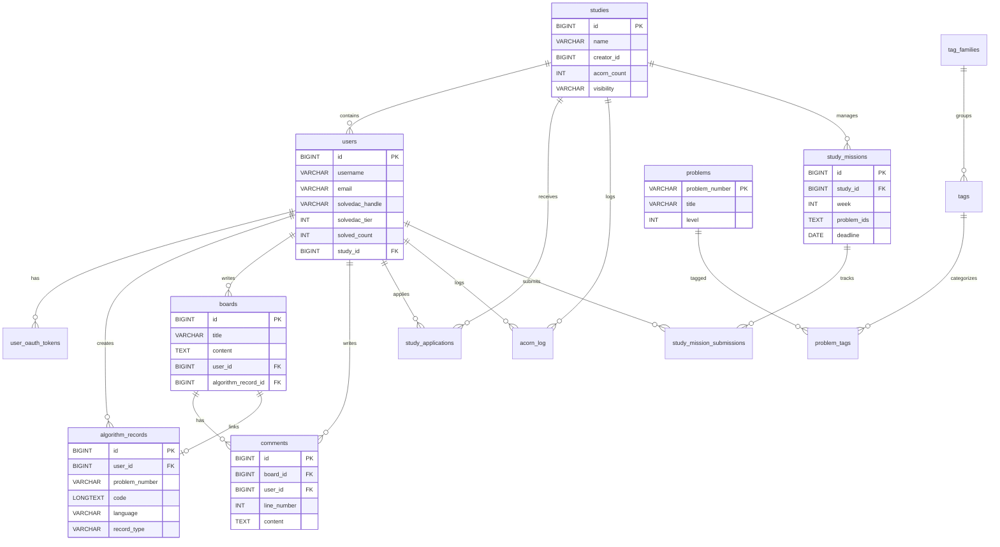

# 4. ER Diagram (ER 다이어그램)

## 4.1 다이어그램

## 4.2 주요 테이블 설명
- **users**: 사용자 정보를 저장하며, `study_id`를 통해 소속된 스터디를 참조한다.
- **algorithm_records**: 사용자의 문제 풀이 기록을 저장한다. `record_type`으로 일반 풀이, 모의고사, 랜덤 디펜스 등을 구분한다.
- **study_missions**: 스터디의 주차별 미션 정보를 저장한다. `problem_ids`는 JSON 배열 형태로 문제 목록을 저장한다.
- **boards & comments**: 게시판과 댓글 기능을 담당한다. `comments` 테이블의 `line_number`는 코드 리뷰 시 특정 라인을 지칭하는 데 사용된다.
