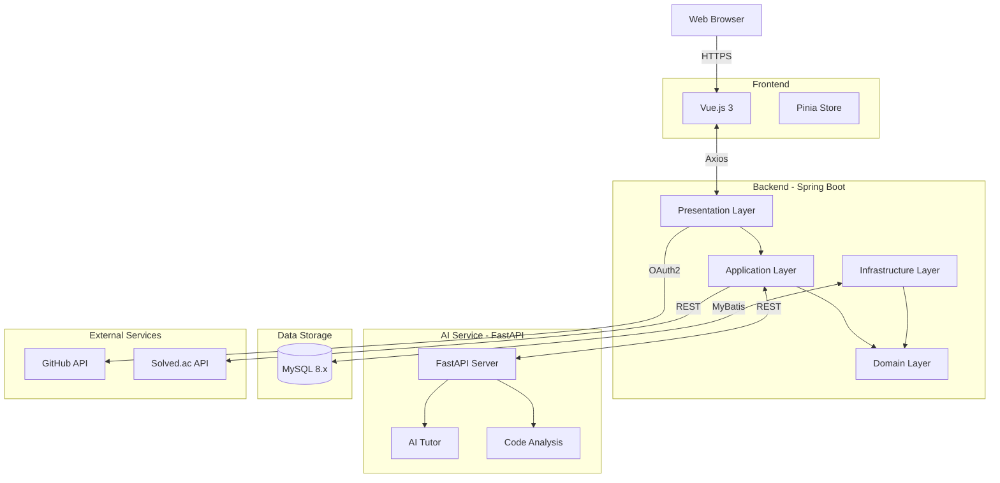

# 7. System Architecture (시스템 아키텍처 및 참고 문서)

## 7.1 시스템 아키텍처 다이어그램



## 7.2 기술 스택 (Tech Stack)

### Client
| 기술 | 설명 |
|:---|:---|
| **Vue.js 3** | Composition API 기반 프론트엔드 프레임워크 |
| **Pinia** | 상태 관리 라이브러리 |
| **Tailwind CSS** | 유틸리티 기반 CSS 프레임워크 |
| **Chart.js** | 통계 시각화 |

### Server (Main)
| 기술 | 설명 |
|:---|:---|
| **Spring Boot 3.x** | 메인 백엔드 프레임워크 |
| **Java 17+** | 프로그래밍 언어 |
| **MySQL 8.x** | 관계형 데이터베이스 |
| **MyBatis** | SQL 매퍼 (Mapper XML + RepositoryImpl) |
| **Spring Security** | OAuth2 세션 기반 인증 |

### Server (AI)
| 기술 | 설명 |
|:---|:---|
| **FastAPI** | Python 비동기 웹 프레임워크 |
| **Python 3.9+** | 프로그래밍 언어 |
| **Google Gemini** | LLM 모델 (코드 분석, 튜터링) |

## 7.3 백엔드 아키텍처 (4-Layer)

```
Presentation → Application → Domain ← Infrastructure
```

| Layer | 책임 |
|:---|:---|
| **Presentation** | REST Endpoint, Request/Response DTO, 인증 컨텍스트 |
| **Application** | Use Case 조합, 트랜잭션 경계, Domain↔DTO 변환 |
| **Domain** | 엔티티, 밸류, Repository Port, 비즈니스 예외 |
| **Infrastructure** | MyBatis Mapper, 외부 API 연동 |

## 7.4 외부 인터페이스 (External Interfaces)
| 서비스 | 용도 |
|:---|:---|
| **GitHub API** | OAuth 로그인, 리포지토리 조회, 웹훅 수신 |
| **Solved.ac API** | 사용자 티어, 문제 정보, 태그별 통계 조회 |
