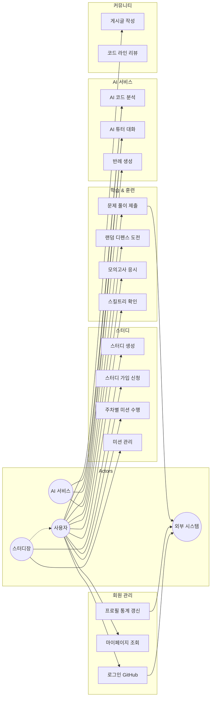

# 2. Use-Case Diagram (Use‑Case 다이어그램)

## 2.1 다이어그램

## 2.2 배우(Actor) 정의
| 액터 | 설명 |
|:---:|:---|
| **사용자 (User)** | 알고리즘 문제를 풀고 학습하는 일반 회원 |
| **스터디장 (Leader)** | 스터디를 생성하고 미션을 관리하는 권한을 가진 사용자 (사용자 역할 상속) |
| **AI 서비스** | 코드 분석, 반례 생성, 튜터링을 제공하는 시스템 액터 |
| **외부 시스템** | GitHub (OAuth, Webhook) 및 Solved.ac API |

## 2.3 주요 Use Case 설명
| Use Case | 설명 |
|:---|:---|
| **로그인** | GitHub OAuth를 통한 소셜 로그인 |
| **주차별 미션 수행** | 스터디에서 할당된 주간 문제 풀이 |
| **랜덤 디펜스** | 티어 기반 랜덤 문제 제한시간 내 풀이 |
| **AI 코드 분석** | 제출 코드의 복잡도, 패턴, 개선점 분석 |
| **코드 라인 리뷰** | 특정 코드 라인에 대한 피드백 작성 |
