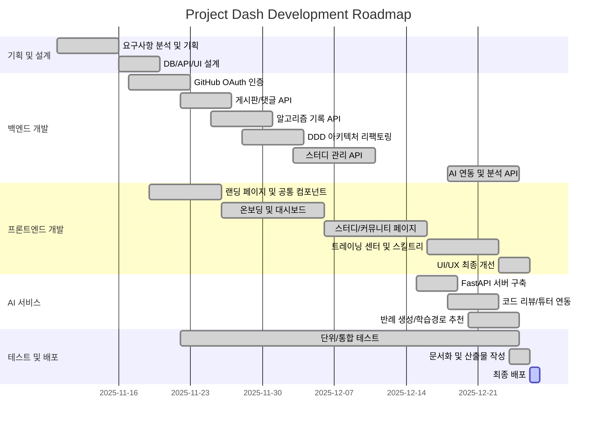

# 5. WBS & Gantt Chart (WBS & 간트 차트)

## 5.1 WBS (Work Breakdown Structure)

1.  **기획 및 분석 (Analysis)** `2025-11-10 ~ 11-15`
    1.1. 요구사항 정의 및 분석
    1.2. 기술 스택 선정 및 환경 설정
    1.3. WBS 및 일정 수립

2.  **설계 (Design)** `2025-11-16 ~ 11-19`
    2.1. 데이터베이스 설계 (ERD)
    2.2. API 명세서 작성
    2.3. UI/UX 화면 설계
    2.4. 시스템 아키텍처 설계

3.  **개발 (Development)** `2025-11-17 ~ 12-24`
    3.1. **Backend**
        3.1.1. 회원가입/로그인 (GitHub OAuth) `11-17 ~ 11-22`
        3.1.2. 게시판 및 댓글 기능 `11-22 ~ 11-26`
        3.1.3. 알고리즘 기록 연동 `11-25 ~ 11-30`
        3.1.4. DDD 리팩토링 `11-28 ~ 12-03`
        3.1.5. 스터디 관리 API `12-03 ~ 12-10`
        3.1.6. AI 연동 및 분석 API `12-18 ~ 12-24`
    3.2. **Frontend**
        3.2.1. 공통 컴포넌트 및 랜딩 페이지 `11-19 ~ 11-25`
        3.2.2. 온보딩 및 대시보드 `11-26 ~ 12-05`
        3.2.3. 스터디 및 커뮤니티 페이지 `12-06 ~ 12-15`
        3.2.4. 트레이닝 센터 및 스킬트리 `12-16 ~ 12-22`
        3.2.5. UI/UX 최종 개선 `12-23 ~ 12-25`
    3.3. **AI Service**
        3.3.1. FastAPI 서버 구축 `12-15 ~ 12-18`
        3.3.2. 코드 리뷰/튜터 모델 연동 `12-18 ~ 12-22`
        3.3.3. 반례 생성기 및 학습경로 추천 `12-20 ~ 12-24`

4.  **테스트 (Testing)** `2025-11-22 ~ 12-24`
    4.1. 단위 테스트 (JUnit)
    4.2. 통합 테스트
    4.3. 사용자 시나리오 테스트 (QA)

5.  **배포 및 산출물 (Deployment)** `2025-12-24 ~ 12-26`
    5.1. 문서화 및 산출물 작성
    5.2. 최종 점검 및 버그 수정
    5.3. 최종 배포

## 5.2 Gantt Chart (프로젝트 일정)

## 5.3 프로젝트 일정 요약

| 구분 | 시작일 | 종료일 | 기간 |
|------|--------|--------|------|
| 기획 및 분석 | 2025-11-10 | 2025-11-15 | 6일 |
| 설계 | 2025-11-16 | 2025-11-19 | 4일 |
| 백엔드 개발 | 2025-11-17 | 2025-12-24 | 38일 |
| 프론트엔드 개발 | 2025-11-19 | 2025-12-25 | 37일 |
| AI 서비스 개발 | 2025-12-15 | 2025-12-24 | 10일 |
| 테스트 | 2025-11-22 | 2025-12-24 | 33일 |
| 배포 및 산출물 | 2025-12-24 | 2025-12-26 | 3일 |
| **총 프로젝트 기간** | **2025-11-10** | **2025-12-26** | **47일** |
